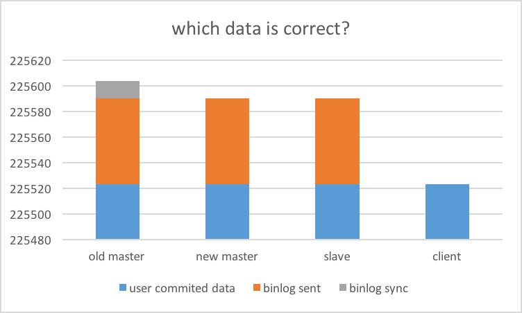
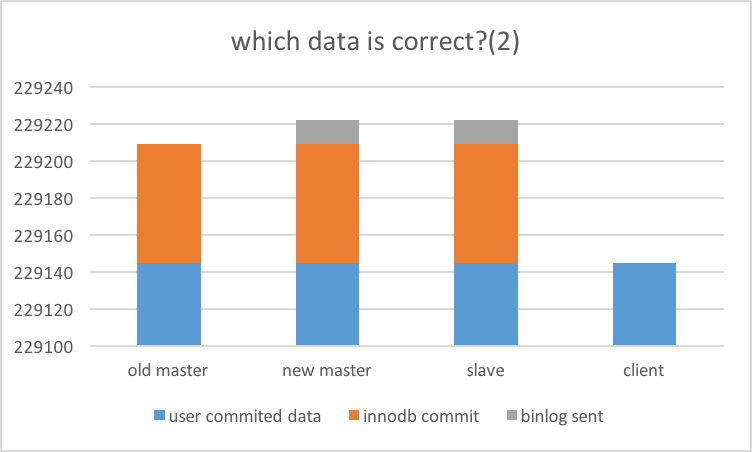

# Crash recovery on MySQL

## Extra data on recovered master
https://www.percona.com/community-blog/2018/08/23/question-about-semi-synchronous-replication-answer-with-all-the-details/
> 매우 주의깊에 읽어보아야한다. 이건 semi-sync뿐만이 아니라 일반 replication구조에서도 일어나는 일이다. 
crash recovery 할때 mysql 은 innodb redo log랑 binary log 모두를 확인해서 recovery 해준다. 이때 slave가 읽어가지 못한 event가 mysql binary log에만 쓰여있었다면, 이것까지 다 recovery 한다. 즉 recovered master 가 slave보다 데이터가 더 많다. 이게 얼마나 심각한 것인지 replication을 사용하는 사용자라면 반드시 확인해야한다.


## Storage engine commit and binlog commit
* 5.7.10이후, innodb_support_xa = 1로 무조건 활성화이다. 이 옵션은 binary_log와, redo_log 를 2 phase commit하도록 해주는데, binary log group commit을 지원하면서 무조건 활성화가 되었다. 비활성화자체가 막혀있다.
  - 참조 : http://minsql.com/blog/semi-synchronous-replication-on-mysql/#distributed-transaction-processing-using-xa 
  
  
* 정리하면, mysql commit의 process는 다음과 같다.
  1. Innodb prepare
  2. Binlog commit
  3. InnoDB commit
  4. Commit return
  

* crash recovery 는 XA recovery를 포함한다. 즉, redo log, binary log 모두를 읽어서 최대한 rollforward시키고, rollback한다.

### 관련 다른 parameters
* innodb_flush_log_at_trx_commit : 설정에 따라서 redo log를 fsync 한다.
* sync_binlog : 설정에 따라서 binlog를 fsync한다.

* 두 파라메터에 따라서 event가 redo, binlog file에 있거나 없거나 할수 있다. 더 복잡하니까 여기서 모두 1로 설정했다고 가정해보자. (실제 default값이기도 하니)

### Do some test1
#### 1. Load generator : sysbench, num-threads=100, insert.lua 1개 테이블에 인서트를 미친듯이 하는 부하를 만들자.
```
sysbench --mysql-user=sbtest --mysql-password=sbtest --mysql-db=sbtest --mysql-host=host1 --mysql-port=3306 --mysql-socket=/tmp/mysql.sock --oltp-table-name=sbtest --oltp-tables-count=1 --test='/usr/share/doc/sysbench/tests/db/insert.lua' --num-threads=100 --max-time=600 --max-requests=0 --report-interval=10 run > sysbench.out &
```

#### 2. kill your master
``` kill -9 $(pid_of_mysql)```

#### 3. check binlog
@old master
```
-rw-r-----  1 mysql dba  120891584 Sep  7 12:23 binary_log.000001
```

@new master
```
Master_Log_File: binary_log.000001
Read_Master_Log_Pos: 120881044
```

@Slave
```
Master_Log_File: binary_log.000001
Read_Master_Log_Pos: 120881044
```

-> crashed old master 에 120891584 썼는데, slaves는 120881044까지만 읽었다.

#### 4. Case 1 : Disk fault가 아니라서 binlog를 살렸다고 가정하자.

#### 5. Failover to new master
- new master는 read master log position까지 모두 execute하고, new master가 되었다. 다른 slave 는 이제 change master to new master했다.
```Seconds_Behind_Master: NULL``` 을 확인한다.
- 상태를 확인하기 위해서 ```stop slave;```

#### 6. old master recovery
@old master
- mysql start
- crash recovery를 진행한다.

#### 7. check data
<table class="relative-table wrapped confluenceTable"><colgroup> <col /> <col /> <col /></colgroup>
<tbody>
<tr>
<th>@old master</th>
<th>@new master</th>
<th>@slave</th>
</tr>
<tr>
<td>
```
root@localhost:(none) 12:15:14>select max(id) from sbtest.sbtest1;
+---------+
| max(id) |
+---------+
|  225605 |
+---------+
1 row in set (0.00 sec)

root@localhost:(none) 12:15:20>select count(1) from sbtest.sbtest1;
+----------+
| count(1) |
+----------+
|   225605 |
+----------+
1 row in set (0.04 sec)
```
</td>
<td>
```
root@localhost:(none) 12:13:27>select max(id) from sbtest.sbtest1;
+---------+
| max(id) |
+---------+
|  225591 |
+---------+
1 row in set (0.00 sec)


root@localhost:(none) 12:13:22>select count(1) from sbtest.sbtest1;
+----------+
| count(1) |
+----------+
|   225591 |
+----------+
1 row in set (0.04 sec)
```
</td>
<td>
```
root@localhost:(none) 12:13:29>select max(id) from sbtest.sbtest1;
+---------+
| max(id) |
+---------+
|  225591 |
+---------+
1 row in set (0.00 sec)


root@localhost:(none) 12:13:08>select count(1) from sbtest.sbtest1;
+----------+
| count(1) |
+----------+
|   225591 |
+----------+
1 row in set (0.04 sec)
```
</td>
</tr>
</table>

#### 8. client log check

@old master
```
root@localhost:(none) 12:15:24>select * from sbtest.sbtest1 order by id desc limit 1;
+--------+------+-------------------------------------------------------------------------------------------------------------------------+-------------------------------------------------------------+
| id     | k    | c                                                                                                                       | pad                                                         |
+--------+------+-------------------------------------------------------------------------------------------------------------------------+-------------------------------------------------------------+
| 225605 | 4957 | 79888982258-61333436979-80792591123-92607263374-50040800467-73148416263-58685905075-76204100553-62710261379-83642825584 | 82186729862-84739608722-43812298929-12190970088-77403548167 |
+--------+------+-------------------------------------------------------------------------------------------------------------------------+-------------------------------------------------------------+
1 row in set (0.00 sec)


root@localhost:(none) 12:16:06>select * from sbtest.sbtest1 order by id desc limit 14,1;
+--------+------+-------------------------------------------------------------------------------------------------------------------------+-------------------------------------------------------------+
| id     | k    | c                                                                                                                       | pad                                                         |
+--------+------+-------------------------------------------------------------------------------------------------------------------------+-------------------------------------------------------------+
| 225591 | 5035 | 83125079753-76845493068-07999607293-02239216888-35640473802-91341354975-57883153786-83817135971-70529862698-88205345062 | 31394025583-27745092928-31936443034-19236847994-74971533578 |
+--------+------+-------------------------------------------------------------------------------------------------------------------------+-------------------------------------------------------------+
1 row in set (0.00 sec)
```

@new master
```
root@localhost:(none) 12:14:48>select * from sbtest.sbtest1 order by id desc limit 1;
+--------+------+-------------------------------------------------------------------------------------------------------------------------+-------------------------------------------------------------+
| id     | k    | c                                                                                                                       | pad                                                         |
+--------+------+-------------------------------------------------------------------------------------------------------------------------+-------------------------------------------------------------+
| 225591 | 5035 | 83125079753-76845493068-07999607293-02239216888-35640473802-91341354975-57883153786-83817135971-70529862698-88205345062 | 31394025583-27745092928-31936443034-19236847994-74971533578 |
+--------+------+-------------------------------------------------------------------------------------------------------------------------+-------------------------------------------------------------+
1 row in set (0.00 sec)
```

@client
```
# cat sysbench_2.out | grep  79888982258-6
ALERT: failed to execute MySQL query: `INSERT INTO sbtest1 (id, k, c, pad) VALUES (0, 4957, '79888982258-61333436979-80792591123-92607263374-50040800467-73148416263-58685905075-76204100553-62710261379-83642825584', '82186729862-84739608722-43812298929-12190970088-77403548167')`:

# cat sysbench_2.out | grep  83125079753-7
ALERT: failed to execute MySQL query: `INSERT INTO sbtest1 (id, k, c, pad) VALUES (0, 5035, '83125079753-76845493068-07999607293-02239216888-35640473802-91341354975-57883153786-83817135971-70529862698-88205345062', '31394025583-27745092928-31936443034-19236847994-74971533578')`:
```
-> semisync, slave 에 들어간데이터이지만 클라이언트는 fail을 받았음


@ old master
```
root@localhost:(none) 12:19:20>select * from sbtest.sbtest1 order by id desc limit 81,1;
+--------+------+-------------------------------------------------------------------------------------------------------------------------+-------------------------------------------------------------+
| id     | k    | c                                                                                                                       | pad                                                         |
+--------+------+-------------------------------------------------------------------------------------------------------------------------+-------------------------------------------------------------+
| 225524 | 5042 | 19722710887-41825524483-02611698822-07466480779-06500555688-30200956896-61619612159-87044566968-90038382663-22637007087 | 09802447442-78333893251-51199296003-01335745442-88653326619 |
+--------+------+-------------------------------------------------------------------------------------------------------------------------+-------------------------------------------------------------+
1 row in set (0.00 sec)

root@localhost:(none) 12:19:29>select * from sbtest.sbtest1 order by id desc limit 82,1;
+--------+------+-------------------------------------------------------------------------------------------------------------------------+-------------------------------------------------------------+
| id     | k    | c                                                                                                                       | pad                                                         |
+--------+------+-------------------------------------------------------------------------------------------------------------------------+-------------------------------------------------------------+
| 225523 | 4999 | 88830428108-21244349412-30076967478-44105296476-54457874100-32901524878-27481376778-84719973276-31930124008-75583547021 | 38444850712-91591550394-45494076064-29120744229-79922105662 |
+--------+------+-------------------------------------------------------------------------------------------------------------------------+-------------------------------------------------------------+
1 row in set (0.00 sec)
```

@client
```
# cat sysbench.out | grep  19722710887
ALERT: failed to execute MySQL query: `INSERT INTO sbtest1 (id, k, c, pad) VALUES (0, 5042, '19722710887-41825524483-02611698822-07466480779-06500555688-30200956896-61619612159-87044566968-90038382663-22637007087', '09802447442-78333893251-51199296003-01335745442-88653326619')`:
# cat sysbench.out | grep  88830428108-
```
-> 81건은 클라이언트가 fail했는데 존재하는 된 데이터임


* which data is correct?

- client가 fail을 받은 데이터도 이미 slave에 존재한다. 어디까지 commit 으로 봐야하는 것일까? 이를 염두해두고 retry해야할 것 같다.

#### 9. what happen next?
* 이상태에서 old master를 그대로 붙이면?
  - master-standby master 서로 master로 바라보는 구성이라면, new master만 old master의 binlog를 읽을 수 있게 되기때문에

<table class="relative-table wrapped confluenceTable"><colgroup> <col /> <col /> <col /></colgroup>
<tbody>
<tr>
<th>@old master</th>
<th>@new master</th>
<th>@slave</th>
</tr>
<tr>
<td>
```
root@localhost:(none) 12:21:35> select count(1) from sbtest.sbtest1
    -> ;
+----------+
| count(1) |
+----------+
|   225605 |
+----------+
1 row in set (0.05 sec)
```
</td><td>
```
new master
root@localhost:(none) 12:21:36>select count(1) from sbtest.sbtest1
    -> ;
+----------+
| count(1) |
+----------+
|   225605 |
+----------+
```
</td><td>
**slave는 데이터를 잃게됨.**
```
root@localhost:(none) 12:21:36>select count(1) from sbtest.sbtest1
    -> ;
+----------+
| count(1) |
+----------+
|   225591 |
+----------+
1 row in set (0.04 sec)
```
</td>
</tr>
</table>

- 심지어 new master가 service-in이 먼저 되었다면, dup이 나게됨.


### Do some test1
#### 1. Load generator : same as above
#### 2. kill your master : same as above
#### 3. check binlog
@old master
```
-rw-r-----  1 mysql dba  118960128 Sep  7 12:12 binary_log.000080
```

@new master
```
Master_Log_File: binary_log.000080
Read_Master_Log_Pos: 118952543
```

@Slave
```
Master_Log_File: binary_log.000080
Read_Master_Log_Pos: 118952543
```

-> crashed old master 에 118960128까지 썼는데, slaves는 118952543까지만 읽었다.

#### 4. Case 2 : Disk fault로 binlog가 더이상 fsync되지 않았거나, binary log file 을 loss한 상황을 가정하자.

#### 5. Failover to new master
- new master는 read master log position까지 모두 execute하고, new master가 되었다. 다른 slave 는 이제 change master to new master했다.
```Seconds_Behind_Master: NULL``` 을 확인한다.
- 상태를 확인하기 위해서 ```stop slave;```

#### 6. old master recovery
@old master
- old master의 binlog를 지우고,
```# mv binary_log.* /tmp```
- mysql start
- crash recovery를 진행한다.

#### 7. check data
<table class="relative-table wrapped confluenceTable"><colgroup> <col /> <col /> <col /></colgroup>
<tbody>
<tr>
<th>@old master</th>
<th>@new master</th>
<th>@slave</th>
</tr>
<tr>
<td>
```
root@localhost:(none) 13:47:20>select count(1) from sbtest.sbtest1;
+----------+
| count(1) |
+----------+
|   229209 |
+----------+
1 row in set (0.05 sec)
```
</td>
<td>
```
root@localhost:(none) 13:46:14>select count(1) from sbtest.sbtest1;
+----------+
| count(1) |
+----------+
|   229222 |
+----------+
1 row in set (0.04 sec)
```
</td>
<td>
```
root@localhost:(none) 13:46:28>select count(1) from sbtest.sbtest1;
+----------+
| count(1) |
+----------+
|   229222 |
+----------+
1 row in set (0.05 sec)
```
</td>
</tr>
</table>

- xa recovery없이 innodb crash recovery만 진행한다면 binlog를 이미 받아간 slave가 더 많은 데이터를 가진다.

#### 8. client log check

@old master
```
root@localhost:(none) 13:47:30>select * from sbtest.sbtest1 order by id desc limit 1;
+--------+------+-------------------------------------------------------------------------------------------------------------------------+-------------------------------------------------------------+
| id     | k    | c                                                                                                                       | pad                                                         |
+--------+------+-------------------------------------------------------------------------------------------------------------------------+-------------------------------------------------------------+
| 229209 | 4977 | 52525542740-05883112138-31077642195-30054907937-74064462099-00624225210-35448309266-20632804320-25010658277-64451131942 | 17224000256-29616103547-98113363624-95788647627-13387357230 |
+--------+------+-------------------------------------------------------------------------------------------------------------------------+-------------------------------------------------------------+
1 row in set (0.00 sec)
```

@client
```
# cat sysbench.out
| grep 52525542740
ALERT: failed to execute MySQL query: `INSERT INTO sbtest1 (id, k, c, pad) VALUES (0, 4977, '52525542740-05883112138-31077642195-30054907937-74064462099-00624225210-35448309266-20632804320-25010658277-64451131942', '17224000256-29616103547-98113363624-95788647627-13387357230')`:
```

@old master
```
root@localhost:(none) 13:49:48>select * from sbtest.sbtest1 order by id desc limit 63,1;
+--------+------+-------------------------------------------------------------------------------------------------------------------------+-------------------------------------------------------------+
| id     | k    | c                                                                                                                       | pad                                                         |
+--------+------+-------------------------------------------------------------------------------------------------------------------------+-------------------------------------------------------------+
| 229146 | 4970 | 48816247772-28840252430-30124535351-86953376118-43261578464-07669086776-76606208916-35289918736-10147949924-75820442447 | 64065821923-83179322010-08568364668-73745057832-25089710423 |
+--------+------+-------------------------------------------------------------------------------------------------------------------------+-------------------------------------------------------------+
1 row in set (0.00 sec)


root@localhost:(none) 13:49:08>select * from sbtest.sbtest1 order by id desc limit 64,1;
+--------+------+-------------------------------------------------------------------------------------------------------------------------+-------------------------------------------------------------+
| id     | k    | c                                                                                                                       | pad                                                         |
+--------+------+-------------------------------------------------------------------------------------------------------------------------+-------------------------------------------------------------+
| 229145 | 4094 | 65666863675-30753985605-04616122135-38522455755-59504944319-44228740748-05905600041-71299214749-25530614096-46064840095 | 24274878022-13012603299-64736092749-48519901391-20055400636 |
+--------+------+-------------------------------------------------------------------------------------------------------------------------+-------------------------------------------------------------+
1 row in set (0.00 sec)
```

@client
```
# cat sysbench.out | grep 48816247772-
ALERT: failed to execute MySQL query: `INSERT INTO sbtest1 (id, k, c, pad) VALUES (0, 4970, '48816247772-28840252430-30124535351-86953376118-43261578464-07669086776-76606208916-35289918736-10147949924-75820442447', '64065821923-83179322010-08568364668-73745057832-25089710423')`:
# cat sysbench_2_a.out | grep 65666863675-
```

- 63건은 client 가 fail을 받은 건이다.
- 여전히 client가 commit을 받지 않은 데이터가 들어갈 수 있다.
- user commit return 보다 engine commit이 먼저니까..


* which data is correct?



## 다시한번 복습
- innodb 2 phase commit
  1. engine prepare
  2. binlog commit
  3. engine commit
  4. commit return


- crash날때, 2-3 사이, 3-4 사이에 있던 transaction은 client가 commit을 제대로 받지 못했는데, DB에 존재하게된다.
- 이를 이해하지 못하거나, 무시하고 replication 구성을 사용한다면, 나중에 데이터가 깨져도 모른다...
  - HA 구성을 사용하는 환경에서 slave 중 하나를 master 로 failover시켜서 서비스한다고 해보자. 
    - crashed old master 를 복구시켰는데 여기에 지금의 master에는 없는 데이터가 있다는 의미다.
    - recovered master를 그대로 new master의 slave 로 붙이면 데이터가 dup날 것이다. 
    - 안나면 더 심각하다. 그냥 데이터가 틀어져버린다. 
  - 여기에 master-standby master의 구성으로 recovered master의 데이터를 new master가 다시 복제해갔다고 생각해보자. 
    - 두대 구성이면 recovered data까지 복구된채로 서비스할 수도 있다. 
    - 하지만 다른 slaves 들이 있다면? 다른 slaves는 이 데이터를 가져갈 수가 없다. 점점 더 데이터는 틀어질 것이다. 


    
## Conclusion
- HA solution 에 따라서 복구에 따른 대응방안을 다시한번 생각해봐야할 때이다.
- 특히 crash master를 복구했다고 무심코 원래 replication set에 넣어버리는 경우가 많은데, 매우 주의해야한다.
- binlog를 최대한 수집해서 new master에 적용시켜주거나..(like MHA)
- failover하게 되었다면, crashed old master는 그냥 붙일 생각말고 재구성하거나..
- 잘 대책을 세워보도록 하자.
